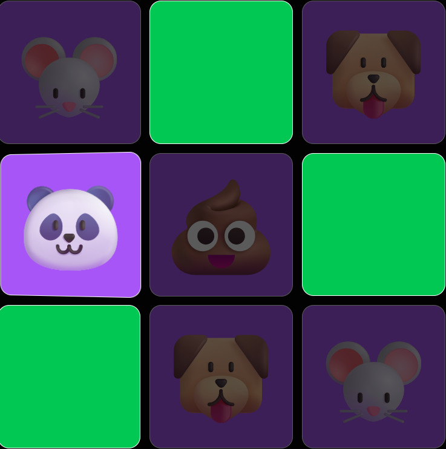

# ✨🃏🧠✨ Vibemoji

A memory card matching game with an emoji-only UI built for the Chainguard Vibelympics challenge!



## Running Locally with Docker

### Prerequisites

- Docker installed and running

### Build and Run

```bash
# Build the image
docker build -t emoji-memory-game .

# Run the container
docker run -p 8080:8080 emoji-memory-game
```

Then navigate to **http://localhost:8080** to play the game.

### Note

You may see this warning in the container logs (it's expected and harmless per Chainguard docs):

```
nginx: [warn] the "user" directive makes sense only if the master process runs with super-user privileges...
```

### Note Note

Debug mode 🐞 is on by default. Clicking the 🐞 button in the game will automatically complete the current level. Make sure to check out the final level (Level 7) for a fun surprise!
