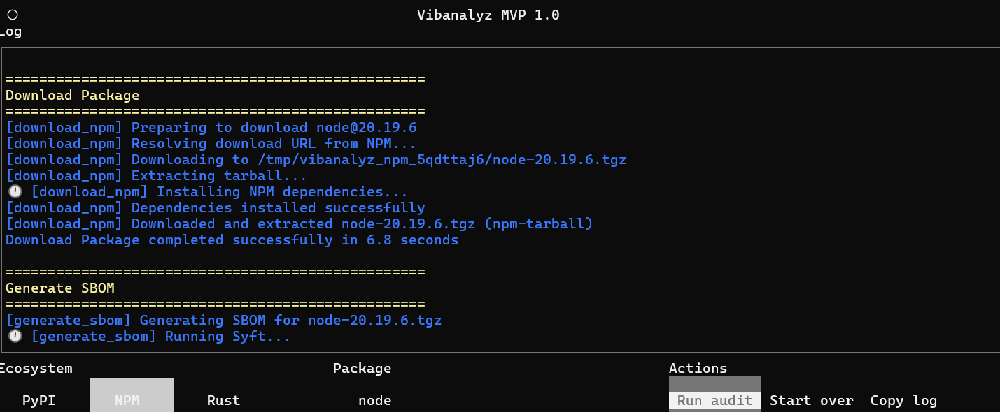
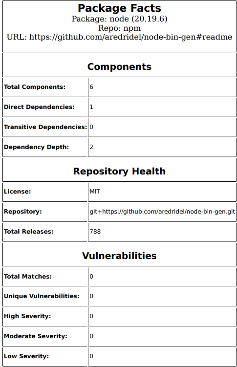

# vibanalyz 🦑

A package security auditing tool for PyPI, NPM, and Rust/Crates.io packages.



Vibanalyz gives you:
- Package SBOM 💣
- Vulnerability Scan
- Customized "Package Facts" PDF
- The peace of mind that comes from running containers using Chainguard's hardened base images



## Overview

vibanalyz is a Python CLI/TUI application for auditing software packages from multiple repository sources. It fetches real package metadata from PyPI, NPM, and Rust/Crates.io registries, downloads packages, generates SBOMs, scans for vulnerabilities, runs security analyses, and produces comprehensive PDF audit reports.

## Current Features

- **Multi-Repository Support**: Audit packages from PyPI, NPM, or Rust/Crates.io registries
- **Real Metadata Fetching**: Live HTTP calls to PyPI JSON API, NPM Registry API, and Crates.io API
- **Textual TUI**: Modern terminal interface with:
  - Package name input with version support (`package==1.0.0`)
  - Repository source selection (PyPI/NPM/Rust)
  - Real-time status updates and detailed logging
  - Error handling with user-friendly messages
- **Modular Pipeline**: Chain-based task execution system
- **SBOM Generation**: CycloneDX JSON format SBOMs using Syft (requires Syft >=1.38.x)
- **Vulnerability Scanning**: CVE detection and analysis using Grype
- **Analyzer Plugin System**: Extensible security analysis framework
- **PDF Report Generation**: Automated audit reports using WeasyPrint (HTML + Jinja2 template) with vulnerability summaries, component metrics, and repository health data
- **Docker Support**: Containerized deployment with Chainguard Python base image (includes Syft and Grype)

## Installation

### Local Development

```bash
pip install -e .
```

**Note for Windows users**: If `pip` is not recognized, try one of these alternatives:
- `python -m pip install -e .`
- `py -m pip install -e .` (using Python launcher)
- `pip3 install -e .` (if Python 3 is installed separately)

### Docker

**Important**: The Dockerfile uses **Chainguard Python images** (`cgr.dev/chainguard/python:latest-dev`) for enhanced security. Do not change this to standard Python images.

Build the container image:

```bash
docker build -t vibanalyz .
```

Artifacts (PDF report and CycloneDX SBOM) are written to an artifacts directory inside the container. Bind-mount that directory to your host to retrieve files after an audit:

- **Simple example** (Windows PowerShell):
  ```powershell
  docker run --rm -it -v C:\Users\YourUsername\vibanalyz-artifacts:/artifacts vibanalyz
  ```
  Replace `YourUsername` with your Windows username, or use any path you prefer.

- Default path (`/artifacts`) with Windows PowerShell (no username editing needed):
  ```powershell
  # Create the host folder if needed
  New-Item -ItemType Directory -Force "$env:USERPROFILE\vibanalyz-artifacts" | Out-Null

  docker run --rm -it `
    -v "$env:USERPROFILE\vibanalyz-artifacts:/artifacts" `
    vibanalyz
  ```
- Custom container path with `ARTIFACTS_DIR`:
  ```powershell
  New-Item -ItemType Directory -Force "$env:USERPROFILE\vibanalyz-artifacts" | Out-Null

  docker run --rm -it `
    -e ARTIFACTS_DIR=/my-artifacts `
    -v "$env:USERPROFILE\vibanalyz-artifacts:/my-artifacts" `
    vibanalyz
  ```
- Optional: set `ARTIFACTS_HOST_PATH` to print your host mount path in logs.

The TUI logs print the container path for each artifact and, when `ARTIFACTS_DIR` or `ARTIFACTS_HOST_PATH` is set, a host-friendly hint to help you locate the files.

**Note on SBOM Format**: SBOMs are generated in CycloneDX JSON format (spec version 1.6) using Syft. Dependency metrics (direct/transitive counts, depth) are derived from the CycloneDX dependency graph when available. When scanning wheel files, Syft may not populate the dependency graph (dependencies section may be empty); in such cases, root components are identified as library/application type components. Requires Syft >=1.38.x for optimal Python dependency detection.

## Usage

### Local

Run without arguments to open the TUI:

```bash
vibanalyz
```

Or provide a package name as an argument:

```bash
vibanalyz requests
```

### Docker

Run the container:

```bash
docker run --rm -it vibanalyz
```

Or with a package name:

```bash
docker run --rm -it vibanalyz requests
```

### In the TUI

1. Enter a package name (optionally with version: `requests==2.31.0` or `serde==1.0.0`)
2. Select the repository source (PyPI, NPM, or Rust)
3. Click "Run audit" or press Enter
4. View real-time progress as the pipeline:
   - Fetches package metadata
   - Downloads the package
   - Generates a CycloneDX SBOM using Syft
   - Scans for vulnerabilities using Grype
   - Runs security analyses
   - Extracts report data
   - Generates a PDF report
5. CycloneDX SBOM and PDF report are generated automatically in the artifacts directory

## Project Structure

```
vibanalyz/
  src/vibanalyz/
    app/                    # Textual TUI application
      main.py               # Main app orchestrator
      state.py              # Application state management
      actions/              # Action handlers (audit, etc.)
      components/           # UI components (log, status, input)
    domain/                 # Domain models and protocols
      models.py             # PackageMetadata, Context, Finding, etc.
      protocols.py          # Task and Analyzer interfaces
      exceptions.py         # PipelineFatalError
      scoring.py            # Risk score computation
    services/               # Pipeline and reporting
      pipeline.py           # Chain-based task orchestration
      pdf_report.py         # PDF report generation (WeasyPrint + Jinja2)
      tasks/                # Pipeline tasks
        fetch_pypi.py       # PyPI metadata fetching
        fetch_npm.py        # NPM metadata fetching
        fetch_rust.py       # Rust/Crates.io metadata fetching
        download_pypi.py    # PyPI package download
        download_npm.py     # NPM package download
        download_rust.py    # Rust package download
        generate_sbom.py    # SBOM generation with Syft
        scan_vulnerabilities.py  # Vulnerability scanning with Grype
        run_analyses.py     # Run all analyzers
        extract_report_data.py   # Extract structured report data
        generate_pdf_report.py   # Generate PDF from report data
    analyzers/              # Security analyzer plugins
      metadata.py           # Metadata analyzer
    adapters/               # External service clients
      pypi_client.py        # PyPI Registry HTTP client
      npm_client.py         # NPM Registry HTTP client
      rust_client.py        # Rust/Crates.io Registry HTTP client
      grype_client.py       # Grype CLI adapter for vulnerability scanning
    cli.py                  # CLI entry point
```

## Architecture

Vibanalyz was created as a [modular monolith](https://en.wikipedia.org/wiki/Monolithic_application). On purpose, even!

### Pipeline System

The audit pipeline uses a chain-based architecture where each repository source has its own task chain:

```python
CHAINS = {
    "pypi": [
        "fetch_pypi",
        "download_pypi",
        "generate_sbom",
        "scan_vulnerabilities",
        "run_analyses",
        "extract_report_data",
        "generate_pdf_report",
    ],
    "npm": [
        "fetch_npm",
        "download_npm",
        "generate_sbom",
        "scan_vulnerabilities",
        "run_analyses",
        "extract_report_data",
        "generate_pdf_report",
    ],
    "rust": [
        "fetch_rust",
        "download_rust",
        "generate_sbom",
        "scan_vulnerabilities",
        "run_analyses",
        "extract_report_data",
        "generate_pdf_report",
    ],
}
```

Tasks are registered in a central registry and resolved by name at runtime, making it easy to add new repository sources.

### Error Handling

- **Package Not Found**: Raises `PipelineFatalError`, stops pipeline, returns partial result
- **Network Errors**: Logged as warnings, pipeline continues if possible
- **Invalid Repository Source**: Raises `ValueError` with available sources

### TUI Architecture

The TUI follows an MVC-like pattern:
- **Components**: UI widgets with simple interfaces (`LogDisplay`, `StatusBar`, `InputSection`)
- **Actions**: Independent business logic handlers (`AuditAction`)
- **State**: Application-wide state tracking (`AppState`)
- **Main App**: Thin orchestrator routing events to handlers

See `architecture_notes.md` for detailed guidelines.

## Roadmap

Future enhancements planned:

- [ ] **Dependency Graph Visualization**: Visualize and analyze dependency trees
- [ ] **Advanced Risk Scoring**: ML-based risk assessment algorithms
- [ ] **Additional Registries**: RubyGems, Go modules, Maven, etc.
- [ ] **CI/CD Integration**: GitHub Actions, GitLab CI support
- [ ] **Policy Engine**: Custom security policy definitions
- [ ] **Report Customization**: Multiple PDF template options
- [ ] **Export Formats**: JSON, CSV, and other report formats

## Adding New Repository Sources

To add support for a new registry (e.g., RubyGems):

1. Create adapter: `adapters/rubygems_client.py`
2. Create task: `services/tasks/fetch_rubygems.py`
3. Add chain to `pipeline.py`: `"rubygems": ["fetch_rubygems", "run_analyses"]`
4. Import task in `services/tasks/__init__.py`

See `vibanalyz_mvp_prompt.md` for detailed instructions.

## License

See [LICENSE](LICENSE) for details.


